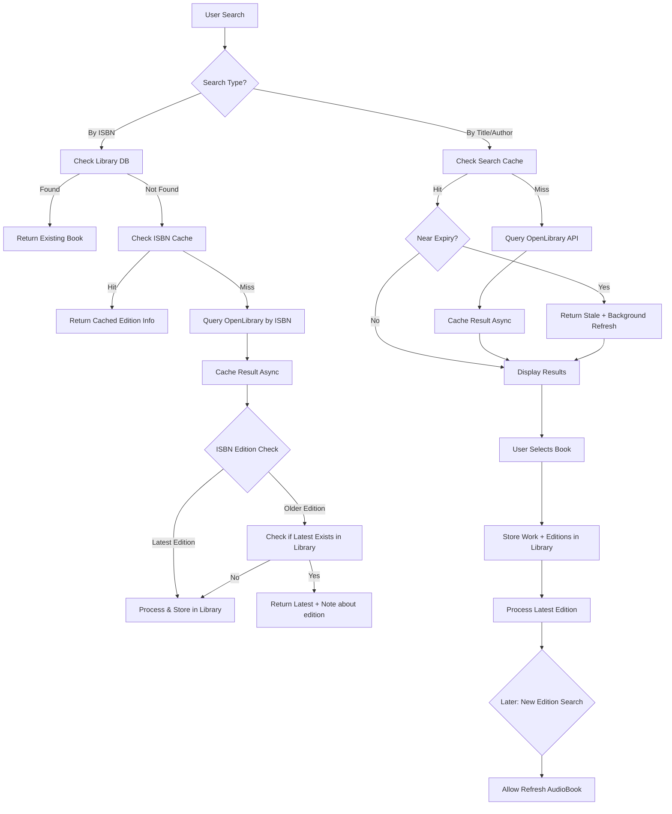
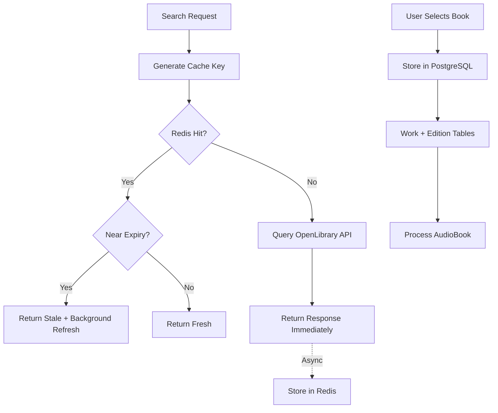

# Phase 3: Enhanced Book Search Flow - Design Document

> **Status:** Approved for Implementation  
> **Last Updated:** 4 December 2025

## Background

Revising Phase 3 to implement a more intuitive book discovery experience before background job processing. The discovered books will become part of our permanent library, not just a transient cache.

---

## OpenLibrary API Research Summary

### Endpoints

| Endpoint                   | Purpose                                                 |
| -------------------------- | ------------------------------------------------------- |
| `/search.json`             | Search books by title, author, publisher, general query |
| `/works/{work_id}.json`    | Get work details (all editions, subjects, etc.)         |
| `/books/{edition_id}.json` | Get specific edition details                            |
| `/search/authors.json`     | Search for authors                                      |
| `covers.openlibrary.org`   | Get cover images by ISBN or OLID                        |

### Query Parameters

```
title       - Search by title
author      - Search by author name
publisher   - Search by publisher
q           - General search query
lang        - Filter by language (e.g., "en", "fr")
limit       - Results per page (default: 20, max: 1000)
offset      - Pagination offset
sort        - new, old, random, key, or by rating
fields      - Specify return fields (include "editions" for edition data)
```

### Response Structure

```json
{
  "numFound": 629,
  "start": 0,
  "docs": [
    {
      "key": "/works/OL27448W",
      "title": "The Lord of the Rings",
      "author_name": ["J. R. R. Tolkien"],
      "author_key": ["OL26320A"],
      "first_publish_year": 1954,
      "edition_count": 120,
      "cover_i": 258027,
      "isbn": ["9780618640157", "0618640150", ...],
      "language": ["eng", "spa", "fre", ...],
      "publisher": ["Houghton Mifflin", ...],
      "editions": { "numFound": 120, "docs": [...] }
    }
  ]
}
```

### Rate Limits

- Covers API: 100 requests/5 min per IP (non-OLID)
- General: Include `User-Agent` header or get blocked
- Bulk: Don't bulk download, use monthly dumps

---

## Architecture Decisions

### 1. Storage Strategy: PostgreSQL (Persistent Library)

The "cache" is not just a cache—it's **building our library** by owning the data discovered from external APIs. Using PostgreSQL for persistence:

```
┌──────────────────────────────────────────────────────────────┐
│                    BookBytes Library                          │
├──────────────────────────────────────────────────────────────┤
│  ┌─────────────┐    ┌─────────────┐    ┌─────────────────┐   │
│  │   Works     │───▶│  Editions   │───▶│   AudioBooks    │   │
│  │ (our data)  │    │ (ISBNs)     │    │ (our content)   │   │
│  └──────┬──────┘    └─────────────┘    └─────────────────┘   │
│         │                                                     │
│         ▼                                                     │
│  ┌─────────────┐                                             │
│  │ BookProviders│  ← Maps our IDs to provider IDs (OL, Google)│
│  └─────────────┘                                             │
│         │                                                     │
│         ▼                                                     │
│  ┌─────────────┐                                             │
│  │  API Cache  │  ← Raw API responses (TTL-based)            │
│  └─────────────┘                                             │
└──────────────────────────────────────────────────────────────┘
```

**Rationale:**

- **Library data is provider-agnostic** - no `openlibrary_key` on core models
- **BookProviders table** maps our UUIDs to provider-specific identifiers
- **Easy to add new providers** (Google Books, etc.) without migrations
- **API Cache** is TTL-based for raw responses
- **Single PostgreSQL database** for consistency

### 2. Edition Handling Strategy (with Cache Integration)



**Cache Touchpoints:**

| Step               | Cache Layer            | Action                          |
| ------------------ | ---------------------- | ------------------------------- |
| Check Library DB   | PostgreSQL (permanent) | Query `editions` table by ISBN  |
| Check ISBN Cache   | Redis → PostgreSQL     | Lookup by ISBN cache key        |
| Check Search Cache | Redis → PostgreSQL     | Lookup by search params hash    |
| Cache Result Async | Redis + PostgreSQL     | Fire-and-forget storage         |
| Store in Library   | PostgreSQL (permanent) | Insert into `works`, `editions` |

**Key Rules:**

1. Default to **latest edition** for new processing
2. If user searches specific ISBN for older edition:
   - If latest not in library → process the requested edition
   - If latest exists → suggest latest, allow override
3. When new edition of existing book is searched → allow **refresh** to regenerate audio

### 3. Pagination: Page Size 100

- Fetch 100 results from OpenLibrary per request
- Internal pagination to client as needed
- Store all results in library on first fetch

---

## Data Models

### Core Library Models (Provider-Agnostic)

```python
# Work - represents a book across all editions (NO provider-specific keys)
class Work(UUIDPrimaryKeyMixin, TimestampMixin, Base):
    __tablename__ = "works"

    # Our owned data - no openlibrary_key here
    title: Mapped[str]
    authors: Mapped[list[str]]  # JSON array
    first_publish_year: Mapped[int | None]
    subjects: Mapped[list[str] | None]  # JSON array
    cover_url: Mapped[str | None]

    # Relationships
    editions: Mapped[list["Edition"]] = relationship(back_populates="work")
    book_providers: Mapped[list["BookProvider"]] = relationship(back_populates="work")

# Edition - specific ISBN/format of a work (NO provider-specific keys)
class Edition(UUIDPrimaryKeyMixin, TimestampMixin, Base):
    __tablename__ = "editions"

    work_id: Mapped[UUID] = mapped_column(ForeignKey("works.id"))
    isbn: Mapped[str] = mapped_column(unique=True, index=True)  # Normalized
    isbn_type: Mapped[str]  # "isbn10" or "isbn13"
    title: Mapped[str]  # Edition-specific title
    publisher: Mapped[str | None]
    publish_year: Mapped[int | None]
    language: Mapped[str] = "eng"
    pages: Mapped[int | None]

    # Relationships
    work: Mapped["Work"] = relationship(back_populates="editions")
    audio_book: Mapped["AudioBook | None"] = relationship(back_populates="edition")
    book_providers: Mapped[list["BookProvider"]] = relationship(back_populates="edition")

# AudioBook - our generated content
class AudioBook(UUIDPrimaryKeyMixin, TimestampMixin, SoftDeleteMixin, Base):
    __tablename__ = "audio_books"

    edition_id: Mapped[UUID] = mapped_column(ForeignKey("editions.id"))
    status: Mapped[str]  # pending, processing, completed, failed
    version: Mapped[int] = 1  # For refresh/regeneration

    # Relationships
    edition: Mapped["Edition"] = relationship(back_populates="audio_book")
    chapters: Mapped[list["Chapter"]] = relationship(back_populates="audio_book")

# Chapter - audio content for a chapter
class Chapter(UUIDPrimaryKeyMixin, TimestampMixin, Base):
    __tablename__ = "chapters"

    audio_book_id: Mapped[UUID] = mapped_column(ForeignKey("audio_books.id"))
    chapter_number: Mapped[int]
    title: Mapped[str]
    summary: Mapped[str]
    audio_file_path: Mapped[str | None]
    audio_url: Mapped[str | None]
    word_count: Mapped[int | None]
    duration_seconds: Mapped[int | None]

    # Relationships
    audio_book: Mapped["AudioBook"] = relationship(back_populates="chapters")
```

### BookProvider Model (Provider-Specific Mapping)

```python
class BookProviderType(str, Enum):
    """Supported external data providers."""
    OPENLIBRARY = "openlibrary"
    GOOGLE_BOOKS = "google_books"
    # Future: AMAZON, GOODREADS, etc.

class BookProvider(UUIDPrimaryKeyMixin, TimestampMixin, Base):
    """
    Maps our internal UUIDs to external provider IDs.
    Decouples our data model from any specific provider.
    """
    __tablename__ = "book_providers"

    # Polymorphic: can link to Work or Edition
    entity_type: Mapped[str]  # "work" or "edition"
    entity_id: Mapped[UUID]   # Our internal UUID

    # Provider info
    provider: Mapped[str]      # e.g., "openlibrary", "google_books"
    external_key: Mapped[str]  # e.g., "/works/OL27448W", "google:abc123"

    # Optional: provider-specific metadata
    provider_metadata: Mapped[dict | None]  # JSON - any extra provider data

    # Relationships (nullable - only one will be set)
    work_id: Mapped[UUID | None] = mapped_column(ForeignKey("works.id"))
    edition_id: Mapped[UUID | None] = mapped_column(ForeignKey("editions.id"))
    work: Mapped["Work | None"] = relationship(back_populates="book_providers")
    edition: Mapped["Edition | None"] = relationship(back_populates="book_providers")

    # Unique constraint: one provider key per entity
    __table_args__ = (
        UniqueConstraint("provider", "external_key", name="uq_provider_external_key"),
        Index("ix_entity_lookup", "entity_type", "entity_id"),
    )
```

**Benefits of BookProvider Table:**

| Benefit               | Description                                          |
| --------------------- | ---------------------------------------------------- |
| **Provider-agnostic** | Core models don't know about OpenLibrary             |
| **Multi-provider**    | Same Work can have IDs from multiple providers       |
| **No migrations**     | Adding a new provider = new rows, not schema changes |
| **Easy lookups**      | Find Work by OpenLibrary key OR Google Books ID      |

**Example Usage:**

```python
# Find our Work by any provider's external ID
async def find_work_by_provider(provider: str, external_key: str) -> Work | None:
    bp = await db.query(BookProvider).filter_by(
        provider=provider,
        external_key=external_key,
        entity_type="work"
    ).first()
    return bp.work if bp else None

# Store provider mapping when importing
async def link_to_provider(work: Work, provider: str, key: str) -> None:
    await db.add(BookProvider(
        entity_type="work",
        entity_id=work.id,
        work_id=work.id,
        provider=provider,
        external_key=key
    ))
```

### API Cache Model

> **REMOVED:** The `APICache` PostgreSQL table has been removed. See below for rationale.

### Cache TTL Policy

| Data Type       | Redis TTL | Rationale                      |
| --------------- | --------- | ------------------------------ |
| Search results  | 24 hours  | Balance freshness vs API calls |
| Work details    | 7 days    | Stable metadata                |
| Edition details | 7 days    | Stable metadata                |

### 4. Cache Key Design (Pagination & Ordering)

**Problem:** How to ensure consistent pagination across requests and cache matching across users?

**Example Scenario:**

1. User A searches for "Book-A" → We fetch 100 results from OpenLibrary, cache them
2. User A views page 1 (results 1-10) from our API
3. User A goes to page 2 (results 11-20) from our API
4. User B searches for "Book-A" → Should hit the same cache

**Solution: Deterministic Cache Key**

```python
def generate_cache_key(params: SearchParams) -> str:
    """
    Generate a deterministic cache key from search parameters.
    Same search = same key = cache hit.
    """
    # Normalize: lowercase, strip whitespace, sort keys
    normalized = {
        "title": params.title.lower().strip(),
        "author": (params.author or "").lower().strip(),
        "publisher": (params.publisher or "").lower().strip(),
        "language": params.language.lower().strip(),
    }
    # Remove empty values
    normalized = {k: v for k, v in normalized.items() if v}

    # Create deterministic string
    key_parts = sorted(f"{k}={v}" for k, v in normalized.items())
    key_string = "&".join(key_parts)

    # Hash for storage efficiency
    return f"search:{hashlib.sha256(key_string.encode()).hexdigest()[:16]}"
```

**Example Cache Keys:**

```
Search: title="Lord of the Rings", author="Tolkien"
Key:    search:a3f2b1c4d5e6f7a8

Search: title="lord of the rings", author="tolkien"  (different case)
Key:    search:a3f2b1c4d5e6f7a8  (SAME - normalized)

Search: title="Lord of the Rings" (no author)
Key:    search:b9c8d7e6f5a4b3c2  (DIFFERENT - different params)
```

### 5. Cache Strategy: Redis-Only with AOF Persistence

> **Key Clarification:** There are two distinct data categories:
>
> | Category         | Storage    | Purpose                  | Persistence                           |
> | ---------------- | ---------- | ------------------------ | ------------------------------------- |
> | **Search Cache** | Redis only | Avoid repeated API calls | Temporary (survives restarts via AOF) |
> | **Library Data** | PostgreSQL | Our processed books      | Permanent (Works, Editions)           |
>
> Search results are **transient** - if lost, users simply re-search. The important data (processed books) lives permanently in PostgreSQL Work/Edition tables.

**Why Not Two-Tier (Redis + PostgreSQL)?**

Originally we planned PostgreSQL as L2 cache backup. After analysis:

| Concern                | Reality                                                                                     |
| ---------------------- | ------------------------------------------------------------------------------------------- |
| **Survives restarts?** | Redis AOF with `appendfsync everysec` survives restarts (max 1 sec data loss)               |
| **Cache important?**   | Search cache is convenience, not critical. Permanent data is already in Work/Edition tables |
| **Complexity cost**    | Two-tier adds: APICache table, sync logic, two TTL systems                                  |
| **Benefit**            | Marginal - we'd only save re-fetching from OpenLibrary                                      |

**Decision:** Use **Redis-only** caching with AOF persistence. Simpler architecture, sufficient durability.

**Architecture:**

```
┌─────────────────────────────────────────────────────────────────────┐
│                         API Instances                                │
│  ┌─────────┐  ┌─────────┐  ┌─────────┐                              │
│  │ API #1  │  │ API #2  │  │ API #3  │   (Horizontal Scaling)       │
│  └────┬────┘  └────┬────┘  └────┬────┘                              │
│       │            │            │                                    │
│       └────────────┼────────────┘                                    │
│                    ▼                                                 │
│  ┌─────────────────────────────────────┐                            │
│  │        Redis (Cache Layer)          │  ← Shared, TTL-based       │
│  │  - Search results (24h TTL)         │                            │
│  │  - AOF persistence (survives restart)│                            │
│  │  - LRU eviction on memory limit     │                            │
│  └─────────────────┬───────────────────┘                            │
│                    │                                                 │
│                    │ (On book selection/processing)                  │
│                    ▼                                                 │
│  ┌─────────────────────────────────────┐                            │
│  │    PostgreSQL (Permanent Library)   │  ← Our owned data          │
│  │  - Works table (book metadata)      │                            │
│  │  - Editions table (ISBN, publisher) │                            │
│  │  - AudioBooks table (our content)   │                            │
│  └─────────────────────────────────────┘                            │
└─────────────────────────────────────────────────────────────────────┘
```

**Cache Flow:**



### Caching Policy (Finalized)

**Pattern:** Cache-Aside + TTL + Stale-While-Revalidate

#### TTL Values (with ±10% Jitter)

| Cache Type      | Redis TTL | Jitter |
| --------------- | --------- | ------ |
| Search results  | 24 hours  | ±10%   |
| Work details    | 7 days    | ±10%   |
| Edition details | 7 days    | ±10%   |

**TTL Jitter:** Prevents cache stampede (all keys expiring simultaneously).

```python
def calculate_ttl_with_jitter(base_ttl: int) -> int:
    """Add ±10% random jitter to TTL to prevent stampede."""
    jitter = random.uniform(-0.1, 0.1)
    return int(base_ttl * (1 + jitter))
```

#### Stale-While-Revalidate

When cache entry is near expiry (< 20% TTL remaining):

1. **Return stale data immediately** (fast response)
2. **Trigger background refresh** (update cache async)
3. **Next request gets fresh data**

```python
REVALIDATE_THRESHOLD = 0.2  # 20% of TTL remaining

async def get_with_stale_revalidate(cache_key: str) -> tuple[dict | None, bool]:
    """
    Returns (data, is_stale).
    If stale, caller should trigger background refresh.
    """
    result, ttl = await redis.get_with_ttl(cache_key)
    if not result:
        return None, False

    needs_revalidation = ttl < (original_ttl * REVALIDATE_THRESHOLD)
    return json.loads(result), needs_revalidation
```

#### Invalidation Policy

| Trigger               | Action              | Scope                         |
| --------------------- | ------------------- | ----------------------------- |
| **TTL expiry**        | Auto-delete         | Single entry                  |
| **User refresh book** | Manual delete       | Work + related search pattern |
| **Book processed**    | Invalidate searches | `search:*` pattern            |
| **Memory pressure**   | LRU eviction        | Least recently accessed       |

#### Redis Configuration

```redis
# Persistence: AOF for durability
appendonly yes
appendfsync everysec          # Sync every second (max 1 sec data loss)
auto-aof-rewrite-percentage 100
auto-aof-rewrite-min-size 64mb

# Memory management
maxmemory 256mb
maxmemory-policy allkeys-lru   # Evict least-recently-used when full
```

When Redis hits memory limit, evict least-recently-used keys first.

### CacheService Implementation (Redis-Only)

```python
class CacheService:
    """Redis-only caching with TTL and stale-while-revalidate."""

    REVALIDATE_THRESHOLD = 0.2  # Trigger refresh at 20% TTL remaining

    async def get(self, cache_key: str) -> tuple[dict | None, bool]:
        """
        Get from cache. Returns (data, needs_revalidation).
        If needs_revalidation=True, caller should refresh in background.
        """
        result = await self.redis.get(cache_key)
        if not result:
            return None, False

        ttl = await self.redis.ttl(cache_key)
        original_ttl = self._get_original_ttl(cache_key)  # From key prefix
        needs_revalidation = (ttl / original_ttl) < self.REVALIDATE_THRESHOLD

        return json.loads(result), needs_revalidation

    async def set(
        self,
        cache_key: str,
        data: dict,
        base_ttl: int
    ) -> None:
        """Store in Redis with jittered TTL."""
        ttl = self._jitter_ttl(base_ttl)
        await self.redis.setex(cache_key, ttl, json.dumps(data))

    async def invalidate(self, cache_key: str) -> None:
        """Delete a specific cache key."""
        await self.redis.delete(cache_key)

    async def invalidate_pattern(self, pattern: str) -> None:
        """Delete all keys matching pattern (e.g., 'search:*')."""
        async for key in self.redis.scan_iter(match=pattern):
            await self.redis.delete(key)

    def _jitter_ttl(self, base_ttl: int) -> int:
        """Add ±10% jitter to prevent stampede."""
        jitter = random.uniform(-0.1, 0.1)
        return int(base_ttl * (1 + jitter))

    def _get_original_ttl(self, cache_key: str) -> int:
        """Get original TTL based on key prefix."""
        if cache_key.startswith("search:"):
            return 86400  # 24 hours
        elif cache_key.startswith("work:") or cache_key.startswith("edition:"):
            return 604800  # 7 days
        return 86400  # Default 24 hours
```

**Key Points:**

1. **Redis only:** Simple, fast, shared across all instances
2. **AOF persistence:** Survives restarts (max 1 second data loss with `appendfsync everysec`)
3. **LRU eviction:** Automatically evicts old keys when memory limit reached
4. **Stale-While-Revalidate:** Return stale data fast, refresh in background
5. **TTL Jitter:** ±10% prevents cache stampede
6. **Invalidation:** Pattern-based deletion for search caches
7. **No PostgreSQL cache table:** Library data (Work/Edition) is permanent, search cache is transient

---

### 6. Future Scope: Multi-API Support

**Problem:** What if we want to integrate APIs other than OpenLibrary, or use multiple APIs to avoid rate limits?

**Solution: Provider Abstraction**

```python
from abc import ABC, abstractmethod

class BookSearchProvider(ABC):
    """Abstract base for book search APIs."""

    @property
    @abstractmethod
    def provider_name(self) -> str:
        """Unique identifier for caching."""
        pass

    @abstractmethod
    async def search(self, params: SearchParams) -> list[BookResult]:
        pass

    @abstractmethod
    async def get_work_details(self, work_id: str) -> WorkDetails:
        pass


class OpenLibraryProvider(BookSearchProvider):
    provider_name = "openlibrary"

    async def search(self, params: SearchParams) -> list[BookResult]:
        # OpenLibrary implementation
        pass


class GoogleBooksProvider(BookSearchProvider):
    provider_name = "googlebooks"

    async def search(self, params: SearchParams) -> list[BookResult]:
        # Google Books API implementation
        pass


class BookSearchService:
    """Orchestrates multiple providers with rate limit handling."""

    def __init__(self, providers: list[BookSearchProvider]):
        self.providers = providers
        self.rate_limiters = {p.provider_name: RateLimiter() for p in providers}

    async def search(self, params: SearchParams) -> list[BookResult]:
        # Try providers in order, skip if rate limited
        for provider in self.providers:
            if not self.rate_limiters[provider.provider_name].is_limited():
                try:
                    return await provider.search(params)
                except RateLimitError:
                    self.rate_limiters[provider.provider_name].mark_limited()

        raise AllProvidersRateLimitedError()
```

**Cache Key with Provider:**

```python
# Cache key includes provider for multi-API support
cache_key = f"{provider_name}:search:{hash}"
# e.g., "openlibrary:search:a3f2b1c4d5e6f7a8"
# e.g., "googlebooks:search:a3f2b1c4d5e6f7a8"
```

**Phase 3 Scope:** OpenLibrary only. Multi-API is future enhancement.

---

## API Endpoints

### Search Endpoints

```python
@router.post("/books/search")
async def search_books(
    request: BookSearchRequest
) -> BookSearchResponse:
    """
    Search OpenLibrary for books.
    Results are cached and stored in library.

    Request: { title, author?, publisher?, language? }
    Response: { results: [...], total, page, page_size }
    """

@router.get("/books/works/{work_id}")
async def get_work(work_id: UUID) -> WorkResponse:
    """Get work details including all editions."""

@router.get("/books/isbn/{isbn}")
async def get_by_isbn(isbn: str) -> EditionResponse:
    """
    Lookup by ISBN.
    1. Check library
    2. If not found, query OpenLibrary
    3. Store and return
    """
```

### Processing Endpoints

```python
@router.post("/books/process")
async def process_book(
    request: ProcessBookRequest  # edition_id OR isbn
) -> ProcessBookResponse:
    """
    Start audiobook generation for an edition.
    Returns job_id for tracking.
    """

@router.post("/books/{audio_book_id}/refresh")
async def refresh_audiobook(
    audio_book_id: UUID
) -> ProcessBookResponse:
    """
    Regenerate audiobook (new version).
    Used when new edition available or content update.
    """
```

---

## Service Layer

### OpenLibraryService

```python
class OpenLibraryService:
    """Client for OpenLibrary API with caching."""

    BASE_URL = "https://openlibrary.org"
    PAGE_SIZE = 100  # Fetch 100 results per API call

    async def search_books(
        self,
        title: str,
        author: str | None = None,
        publisher: str | None = None,
        language: str = "eng",
        page: int = 1
    ) -> SearchResult:
        """
        1. Check API cache
        2. If miss, query OpenLibrary
        3. Store in cache + library
        4. Return results
        """

    async def get_work_details(
        self,
        work_key: str  # e.g., "OL27448W"
    ) -> Work:
        """Fetch and store work details."""

    async def get_all_isbns_for_work(
        self,
        work_key: str
    ) -> list[str]:
        """Get all ISBNs across all editions of a work."""
```

### LibraryService (Provider-Agnostic)

```python
class LibraryService:
    """Manages our book library with provider-agnostic lookups."""

    async def find_work_by_provider(
        self,
        provider: str,
        external_key: str
    ) -> Work | None:
        """Find a work by any external provider ID."""
        bp = await self.db.query(BookProvider).filter_by(
            provider=provider,
            external_key=external_key,
            entity_type="work"
        ).first()
        return bp.work if bp else None

    async def get_or_create_work(
        self,
        title: str,
        authors: list[str],
        provider: str | None = None,
        external_key: str | None = None,
        **data
    ) -> Work:
        """
        Get existing or create new work.
        If provider/external_key given, check BookProvider first.
        """
        if provider and external_key:
            existing = await self.find_work_by_provider(provider, external_key)
            if existing:
                return existing

        # Create new work
        work = Work(title=title, authors=authors, **data)
        self.db.add(work)
        await self.db.flush()

        # Link to provider if given
        if provider and external_key:
            await self.link_to_provider(work, "work", provider, external_key)

        return work

    async def link_to_provider(
        self,
        entity: Work | Edition,
        entity_type: str,
        provider: str,
        external_key: str
    ) -> BookProvider:
        """Create mapping from our entity to external provider ID."""
        bp = BookProvider(
            entity_type=entity_type,
            entity_id=entity.id,
            provider=provider,
            external_key=external_key,
            work_id=entity.id if entity_type == "work" else None,
            edition_id=entity.id if entity_type == "edition" else None
        )
        self.db.add(bp)
        return bp

    async def find_by_isbn(self, isbn: str) -> Edition | None:
        """Find edition by ISBN in library."""
        return await self.db.query(Edition).filter_by(isbn=isbn).first()

    async def find_latest_edition(
        self,
        work_id: UUID,
        language: str = "eng"
    ) -> Edition | None:
        """Find latest edition of a work by publish year."""
        return await self.db.query(Edition).filter_by(
            work_id=work_id,
            language=language
        ).order_by(Edition.publish_year.desc()).first()
```

---

## Implementation Phases

### Phase 3.A: Data Models & Migrations

- [ ] Create `models/work.py` (provider-agnostic)
- [ ] Create `models/edition.py` (provider-agnostic)
- [ ] Create `models/book_provider.py` (provider mapping)
- [ ] Create `models/audio_book.py`
- [ ] Create `models/chapter.py`
- [ ] Create `models/api_cache.py`
- [ ] Generate and run migration

### Phase 3.B: Cache Service

- [ ] Create `services/cache.py` (two-tier)
- [ ] Implement Redis L1 + PostgreSQL L2
- [ ] Add TTL jitter
- [ ] Add stale-while-revalidate
- [ ] Add async storage on API response
- [ ] Add invalidation methods

### Phase 3.C: OpenLibrary Service

- [ ] Create `services/openlibrary.py`
- [ ] Implement search with caching
- [ ] Implement work/edition fetching
- [ ] Add User-Agent header for rate limit compliance
- [ ] Map responses to provider-agnostic models

### Phase 3.D: Library Service

- [ ] Create `services/library.py`
- [ ] Implement `find_work_by_provider()`
- [ ] Implement `get_or_create_work()` with provider linking
- [ ] Implement `link_to_provider()`
- [ ] Implement ISBN lookup
- [ ] Implement latest edition finder

### Phase 3.E: API Endpoints

- [ ] Create `api/v1/search.py`
- [ ] Create search endpoints
- [ ] Update `api/v1/books.py` with process/refresh

### Phase 3.E: Background Jobs

- [ ] Create Job model
- [ ] Create ARQ worker settings
- [ ] Implement `process_book_task`

### Phase 3.F: Testing

- [ ] Unit tests for services
- [ ] Integration tests for search flow
- [ ] Mock OpenLibrary responses

---

## Success Metrics

| Metric                    | Target                       |
| ------------------------- | ---------------------------- |
| Library Hit Rate          | >70% after 1 month           |
| Search Latency (cached)   | <200ms                       |
| Search Latency (API call) | <2s                          |
| ISBN Collection           | 100% of work ISBNs stored    |
| Edition Accuracy          | Latest edition selected 95%+ |
