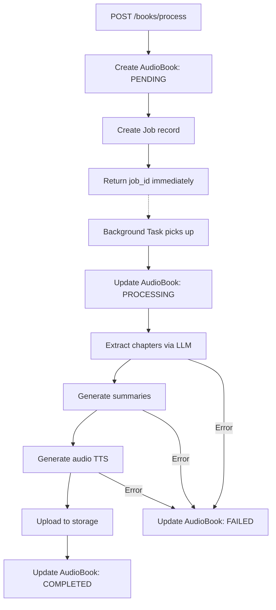

# Audio Books Pipeline - Design Document

> **Status:** Draft - Planning Phase
> **Last Updated:** 11 December 2025

## Background

This document outlines the design for the audiobook processing pipeline that transforms book editions into chapter-wise audio summaries using LLM and TTS services.

---

## TTS & LLM Provider Research

### TTS Provider Comparison

| Provider          | Quality                 | Cost/1M chars                 | Latency        | Best For                       |
| ----------------- | ----------------------- | ----------------------------- | -------------- | ------------------------------ |
| **OpenAI TTS**    | High, natural           | $15 (HD) / $30 (HD)           | Low, streaming | General purpose                |
| **ElevenLabs**    | Premium, most realistic | $45+                          | Low            | Audiobooks, storytelling       |
| **Google Cloud**  | Good, stable            | $4 (standard) / $16 (Neural2) | Very fast      | Scale, enterprise              |
| **Azure**         | Natural, broadcast-like | ~$16                          | Medium         | Long-form, Microsoft ecosystem |
| **gTTS (Google)** | Basic, robotic          | Free                          | Medium         | MVP, cost-sensitive            |

#### Recommendation: **OpenAI TTS**

**Why:**
1. **Quality-to-Cost ratio** - Best balance for audiobook summaries
2. **Same ecosystem** - Already using OpenAI for LLM (shared API key, billing)
3. **Streaming support** - Can stream audio as it's generated
4. **Simple API** - `openai.audio.speech.create()`

**Upgrade path:** ElevenLabs for premium voice quality if needed later.

### LLM Abstraction Options

| Library            | Providers                    | Structured Output    | Maturity     |
| ------------------ | ---------------------------- | -------------------- | ------------ |
| **LiteLLM**        | 100+                         | Via function calling | High         |
| **PydanticAI**     | OpenAI, Claude, Gemini, etc. | Native Pydantic      | Medium       |
| **Instructor**     | OpenAI, Claude + LiteLLM     | Native Pydantic      | High         |
| **Custom wrapper** | Any                          | Manual               | Full control |

#### Recommendation: **Instructor + Custom Interface**

**Why:**
1. **Structured output** - Native Pydantic integration for chapter extraction
2. **Provider agnostic** - Works directly with OpenAI, can use LiteLLM as backend
3. **Type-safe** - Matches our codebase patterns
4. **Proven** - Used in production by many teams

---

## Proposed Architecture

```
┌─────────────────────────────────────────────────────────────┐
│                    ProcessingService                         │
├─────────────────────────────────────────────────────────────┤
│  ┌──────────────────┐          ┌──────────────────┐        │
│  │   LLMService     │          │   TTSService     │        │
│  │  (Instructor)    │          │  (Protocol-based)│        │
│  └────────┬─────────┘          └────────┬─────────┘        │
│           │                              │                  │
│  ┌────────▼─────────┐          ┌────────▼─────────┐        │
│  │ OpenAI Provider  │          │ OpenAI Provider  │        │
│  │ (default)        │          │ (default)        │        │
│  └──────────────────┘          └──────────────────┘        │
│           │                              │                  │
│  ┌────────▼─────────┐          ┌────────▼─────────┐        │
│  │ LiteLLM Backend  │          │ ElevenLabs       │        │
│  │ (optional)       │          │ (upgrade path)   │        │
│  └──────────────────┘          └──────────────────┘        │
└─────────────────────────────────────────────────────────────┘
```

---

## Processing Flow



---

## Service Interfaces

### LLMService

```python
from instructor import Instructor
from pydantic import BaseModel

class ChapterExtraction(BaseModel):
    chapters: list[ChapterInfo]

class ChapterInfo(BaseModel):
    number: int
    title: str
    summary: str

class LLMService:
    """Extract structured data from LLMs."""
    
    def __init__(self, client: Instructor):
        self.client = client
    
    async def extract_chapters(
        self, 
        book_title: str,
        book_author: str,
        num_chapters: int = 10,
    ) -> ChapterExtraction:
        """Extract chapter summaries using LLM."""
```

### TTSService (Protocol-based)

```python
from typing import Protocol, AsyncIterator

class TTSProvider(Protocol):
    """Interface for TTS providers."""
    
    async def synthesize(
        self, 
        text: str,
        voice: str = "alloy",
    ) -> bytes:
        """Generate audio from text."""
    
    async def synthesize_stream(
        self, 
        text: str,
        voice: str = "alloy",
    ) -> AsyncIterator[bytes]:
        """Stream audio as it's generated."""

class OpenAITTSProvider:
    """OpenAI TTS implementation."""

class ElevenLabsTTSProvider:
    """ElevenLabs TTS implementation (future)."""

class TTSService:
    """Wrapper that delegates to configured provider."""
    
    def __init__(self, provider: TTSProvider):
        self.provider = provider
```

---

## Technology Decisions

| Component        | Choice                  | Rationale                               |
| ---------------- | ----------------------- | --------------------------------------- |
| **Job Queue**    | ARQ (Redis)             | Already in deps, native async           |
| **TTS Provider** | OpenAI TTS              | Quality/cost balance, same ecosystem    |
| **LLM Library**  | Instructor              | Structured output, Pydantic integration |
| **Storage**      | Local (dev) / S3 (prod) | Per PRD                                 |
| **Migrations**   | Alembic                 | Already configured                      |

### Provider Abstraction

```python
# Protocol-based interface for TTS
class TTSProvider(Protocol):
    async def synthesize(self, text: str, voice: str) -> bytes: ...
    async def synthesize_stream(self, text: str, voice: str) -> AsyncIterator[bytes]: ...

# Easy to add ElevenLabs, Azure, etc. later
class OpenAITTSProvider(TTSProvider): ...
class ElevenLabsTTSProvider(TTSProvider): ...  # Future
```

---

## API Endpoints

| Endpoint                         | Method | Description                 |
| -------------------------------- | ------ | --------------------------- |
| `/books/process`                 | POST   | Start audiobook generation  |
| `/books/{audio_book_id}/refresh` | POST   | Regenerate with new version |
| `/jobs/{job_id}`                 | GET    | Check job status            |

### Request/Response Schemas

```python
class ProcessRequest(BaseModel):
    edition_id: UUID | None = None
    isbn: str | None = None
    
    @model_validator(mode="after")
    def require_one(self) -> Self:
        if not self.edition_id and not self.isbn:
            raise ValueError("Provide edition_id or isbn")
        return self

class ProcessResponse(BaseModel):
    job_id: UUID
    audio_book_id: UUID
    status: str
    message: str

class JobStatusResponse(BaseModel):
    id: UUID
    status: str  # pending, processing, completed, failed
    audio_book_id: UUID | None
    progress: int | None  # 0-100 percentage
    error_message: str | None
    created_at: datetime
    updated_at: datetime
```

---

## Data Models

### Job Model

```python
class JobStatus(str, Enum):
    PENDING = "pending"
    PROCESSING = "processing"
    COMPLETED = "completed"
    FAILED = "failed"

class JobType(str, Enum):
    AUDIOBOOK_GENERATION = "audiobook_generation"
    AUDIOBOOK_REFRESH = "audiobook_refresh"

class Job(UUIDPrimaryKeyMixin, TimestampMixin, Base):
    __tablename__ = "jobs"
    
    job_type: Mapped[str]
    status: Mapped[str] = default(JobStatus.PENDING)
    audio_book_id: Mapped[UUID | None]  # FK to audiobooks
    progress: Mapped[int] = default(0)
    error_message: Mapped[str | None]
    started_at: Mapped[datetime | None]
    completed_at: Mapped[datetime | None]
```

---

## Dependencies

```toml
[project.dependencies]
instructor = ">=1.0.0"    # Structured LLM output
# openai already in deps
# arq already in deps
```

---

## Implementation Order

### Phase 1: Endpoints (2-3 hours)
1. Create `schemas/processing.py`
2. Create `api/v1/processing.py` router
3. Add to v1 router
4. Unit tests

### Phase 2: Job Infrastructure (2-3 hours)
1. Create `models/job.py`
2. Generate Alembic migration  
3. Create `repositories/job.py`

### Phase 3: LLM Service (3-4 hours)
1. Add instructor to deps
2. Create `services/llm.py` with chapter extraction
3. Unit tests with mocked responses

### Phase 4: TTS Service (2-3 hours)
1. Create `services/tts.py` with Protocol
2. Implement OpenAITTSProvider
3. Unit tests

### Phase 5: Processing Pipeline (3-4 hours)
1. Create `services/processing.py`
2. Create `workers/tasks.py` with ARQ task
3. Create `workers/settings.py`
4. Integration tests

**Total Estimated Time:** 12-14 hours
